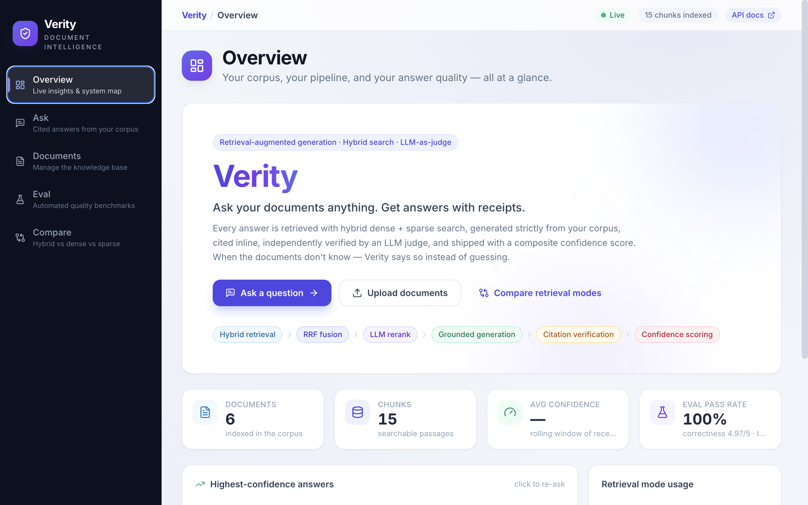
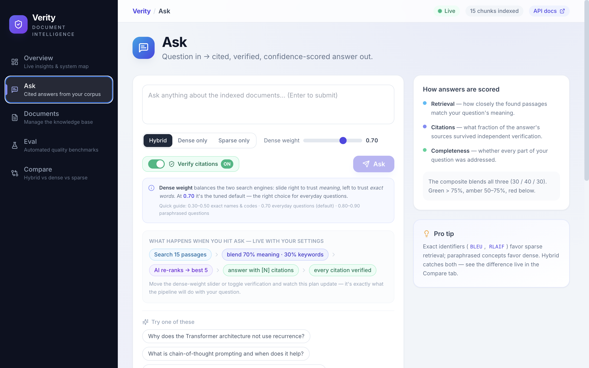
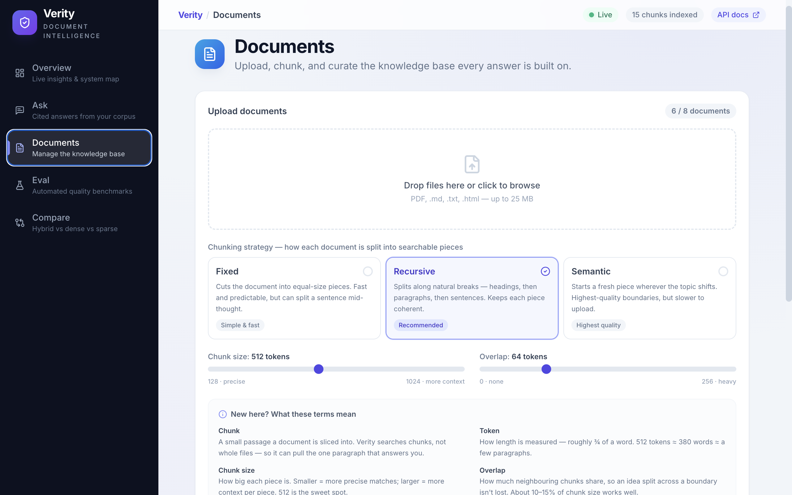
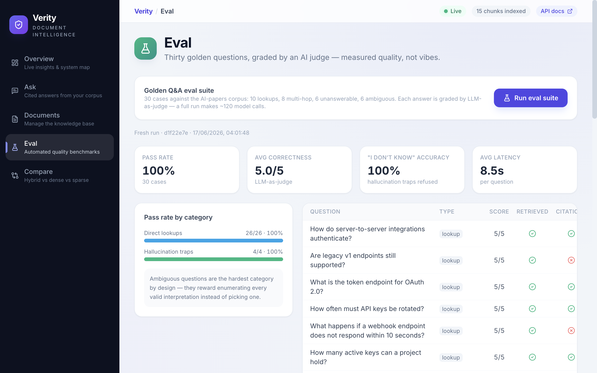
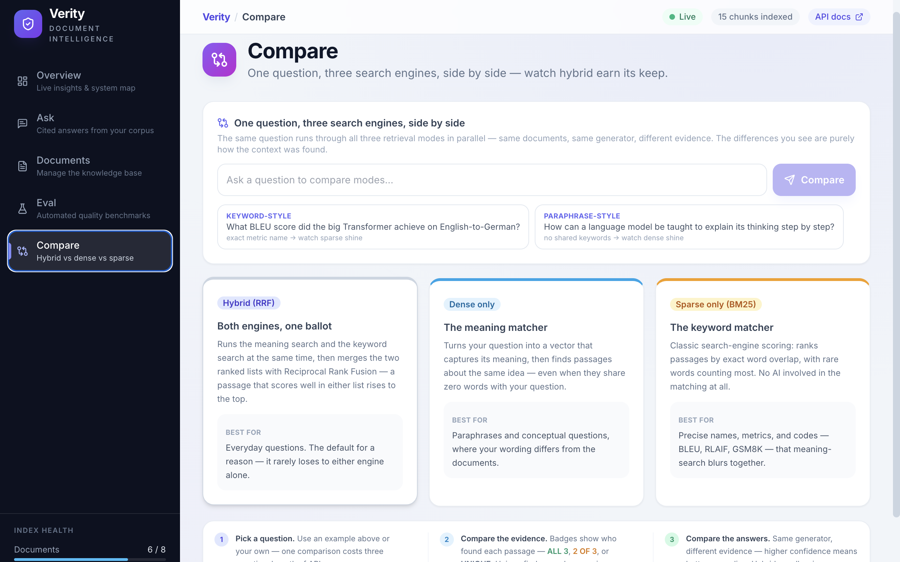

<div align="center">
  <h1>Verity</h1>
  <p><b>Production-grade RAG pipeline with hybrid retrieval, citation verification, and hallucination-resistant AI responses.</b></p>
  
  <p>
    
    
    
    
    
    
    
    
    
  </p>

  <h3>
    <a href="https://verity-rag-pipeline-project.vercel.app">🚀 Live Demo</a>
    <span> | </span>
    <a href="https://verity-rag-pipeline-project.onrender.com/docs">📖 API Docs</a>
    <span> | </span>
    <a href="https://github.com/ishanbhattacharjee12/Verity-RAG-Pipeline-Project">📂 GitHub Repository</a>
  </h3>
</div>

---

## 🌟 Project Overview

Verity is an end-to-end **Retrieval-Augmented Generation (RAG)** system designed specifically for internal technical documentation. It addresses the core weaknesses of traditional LLM applications—hallucinations, untraceable answers, and brittle dense-only search—by implementing a multi-stage, defensive retrieval and generation architecture. 

**Business & Engineering Value:**
By running parallel dense (ChromaDB) and sparse (BM25) searches, Verity captures both semantic meaning and exact-keyword matches, fusing them via Reciprocal Rank Fusion (RRF). Instead of blindly trusting the LLM's output, Verity enforces a strict contract: every claim must be cited inline, and an independent LLM-as-judge actively verifies each citation post-generation. Unanswerable questions are cleanly refused, guaranteeing a high-trust, hallucination-resistant environment for enterprise knowledge bases.

---

## ✨ Features

- 🔍 **Hybrid Dense + Sparse Retrieval**: Combines semantic understanding (`text-embedding-3-small` via ChromaDB) with exact keyword matching (BM25) to perfectly handle technical jargon and acronyms.
- 🔀 **Reciprocal Rank Fusion (RRF)**: Merges disparate vector and keyword scores mathematically without relying on brittle, corpus-dependent normalization thresholds.
- ⚖️ **LLM-as-Judge Reranking**: Re-evaluates top candidate chunks using `gpt-4o` for extreme precision before generation.
- 📝 **Grounded Responses with Citations**: Forces the generator to cite its sources inline `[1]` for every single claim made.
- 🛡️ **Citation Verification**: An independent evaluation pass verifies that the cited text actually supports the generated claim, visibly penalizing unsupported statements.
- 📊 **Confidence Scoring**: Delivers a composite confidence grade based on retrieval quality (cosine similarity), citation coverage, and completeness.
- 🚫 **Hallucination Refusal**: Actively programmed to say "I don't know" when queried with impossible or off-topic questions.
- 📈 **Evaluation Framework**: Bundled 30-case golden Q&A suite to automatically benchmark regression on pass rates, latency, and correctness.
- 🚀 **Production Deployment**: Fully container-free, single-command local orchestration mapped cleanly to Render and Vercel hosting.

---

## 🏗️ System Architecture

```text
User Request
  │
  ▼
React/Vite Frontend
  │
  ▼
FastAPI Backend
  │
  ├── Hybrid Retrieval Layer
  │      ├── BM25 (Sparse Index)
  │      └── ChromaDB (Dense Vectors)
  │
  ├── Reciprocal Rank Fusion (RRF)
  │      (Fuses Top-10 from both)
  │
  ├── LLM Reranker (Cross-Encoder style)
  │      (Extracts Top-5 precise candidates)
  │
  ├── Grounded Generation
  │      (Drafts answer with inline citations)
  │
  ├── Citation Verification
  │      (Independent judge verifies every claim)
  │
  └── Confidence Scoring
         (Calculates final composite trust metric)
```

---

## 💻 Tech Stack

| Component | Technology | Purpose |
|-----------|------------|---------|
| **Frontend** | React, TypeScript, Vite, Tailwind CSS | High-performance, reactive UI architecture. |
| **Backend** | Python, FastAPI | Asynchronous, highly concurrent API server. |
| **Vector Store** | ChromaDB | Persistent dense vector indexing. |
| **Retrieval** | BM25, Reciprocal Rank Fusion | Keyword extraction and multi-retriever fusion logic. |
| **LLM** | OpenAI API (`gpt-4o`, `text-embedding-3-small`) | Embeddings, generation, and LLM-as-judge passes. |
| **Deployment** | Vercel (Frontend), Render (Backend) | Globally distributed edge and cloud hosting. |
| **Evaluation** | Custom Golden Suite | Automated pipeline regression and correctness benchmarking. |

---

## 📸 Application Showcase

### 1. System Overview Dashboard

*Live insights and system map showing indexed chunks, retrieval health, and system components.*

### 2. Ask Interface & Confidence Scoring

*Demonstrating inline citations, retrieval tuning sliders, and composite confidence metrics.*

### 3. Document Management

*Interactive UI for uploading, defining chunking strategies, and curating the knowledge base.*

### 4. Evaluation Dashboard

*Running the 30-case golden suite to benchmark pipeline correctness and test hallucination traps.*

### 5. Compare Retrieval Methods

*Live visual comparison showing how Hybrid Search outperforms standalone Dense or Sparse retrieval.*

---

## 🧪 Try These Questions (Recruiter Demo)

To see Verity's features in action on the live demo, try asking these specific questions against the bundled fictional corporate corpus:

1. **"What is the onboarding process?"**
   *(Demonstrates basic multi-document synthesis and citation formatting.)*
   
2. **"What are the API authentication requirements?"**
   *(Demonstrates extraction of highly specific technical details.)*
   
3. **"Summarize the deployment guide."**
   *(Demonstrates broad comprehension and generation speed.)*
   
4. **"Which documents discuss incident response?"**
   *(Demonstrates metadata awareness and direct document referencing.)*
   
5. **"What was the company revenue in 2024?"**
   *(Demonstrates strict Hallucination Refusal. The system will politely decline to answer, proving it is tightly grounded in the provided corpus.)*

---

## 🚀 Deployment & Environment

The application is fully configured for cloud deployment on Vercel and Render. 

**Frontend Hosting:** [Vercel](https://vercel.com/)
**Backend Hosting:** [Render](https://render.com/)

### Required Environment Variables

**Backend (`.env`)**
- `OPENAI_API_KEY`: Your OpenAI API key.
- `CORS_ORIGINS`: Your Vercel frontend URL (e.g., `https://verity-rag-pipeline-project.vercel.app`)

**Frontend (`.env`)**
- `VITE_API_BASE`: Your Render backend URL (e.g., `https://verity-rag-pipeline-project.onrender.com`)

---

## 🛠️ Local Development

Prerequisites: Python 3.11+, Node 18+.

**1. Install Dependencies**
```bash
# Installs backend and frontend dependencies, creates Python venv
npm run install:all
```

**2. Configure Environment**
```bash
cp backend/.env.example backend/.env
# Edit backend/.env to include your OPENAI_API_KEY
```

**3. Run Application**
```bash
# Starts FastAPI (8000) and Vite (5173) concurrently
npm run dev
```

---
<p align="center">Built with 💻 by Ishan Bhattacharjee</p>
